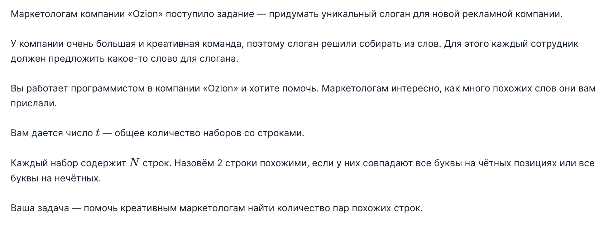
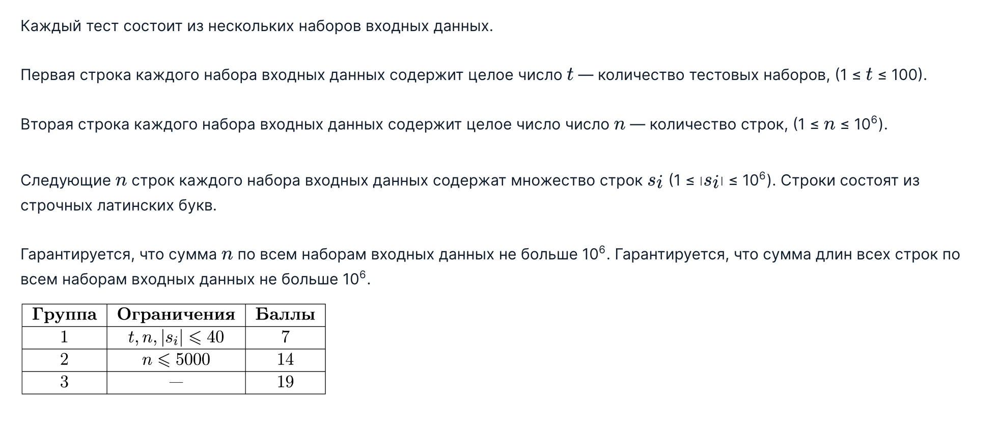
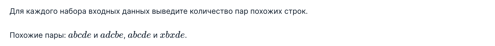

## Task 4: Похожие строки
### Условие задачи

### Входные данные

### Выходные данные

### Пример теста 1
Входные данные
```
7
3
ababa
ababa
ababa
3
asd
das
sda
2
abca
abc
4
aaaa
aaaa
aaaa
aaa
2
aa
aa
2
a
a
2
a
b
```
Выходные данные
```
3
0
1
6
1
1
0
```