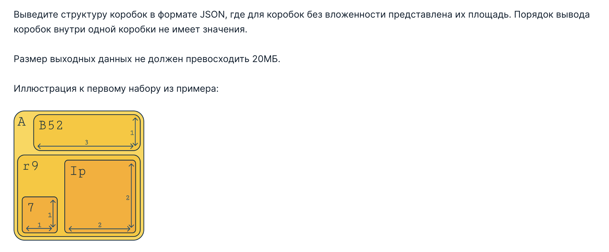

## Task 5: Коробки. Коробки. Коробки

### Условие задачи

### Входные данные

### Выходные данные

### Пример теста 1
Входные данные
```
5
11 12
+----------+
|A+---+....|
|.|B52|....|
|.+---+....|
|+-------+.|
||r9.+--+|.|
||+-+|Ip||.|
|||7||..||.|
||+-++--+|.|
|+-------+.|
+----------+
3 3
...
...
...
3 5
+---+
|I63|
+---+
8 9
+------+.
|256...|.
|......|.
|......|.
+------+.
....+---+
....|R..|
....+---+
3 9
+-++-++-+
|2||5||6|
+-++-++-+
```
Выходные данные
```
[
  {
    "A": {
      "B52": 3,
      "r9": {
        "7": 1,
        "Ip": 4
      }
    }
  },
  {},
  {
    "I63": 3
  },
  {
    "256": 18,
    "R": 3
  },
  {
    "2": 1,
    "5": 1,
    "6": 1
  }
]
```