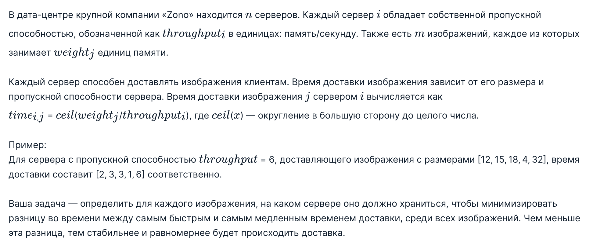
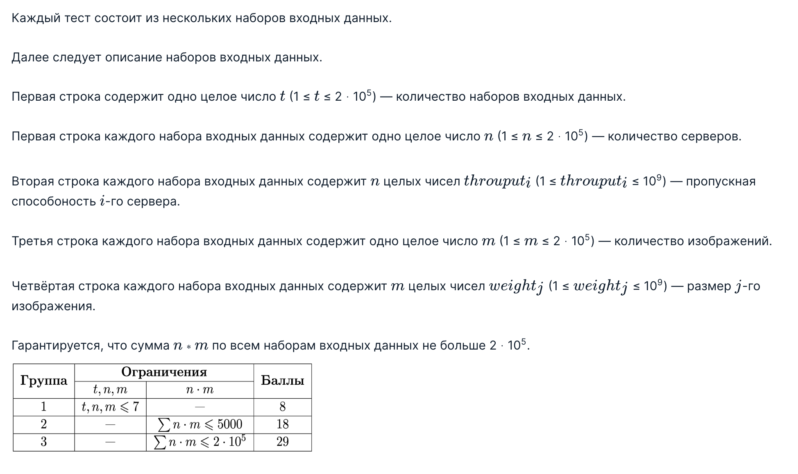
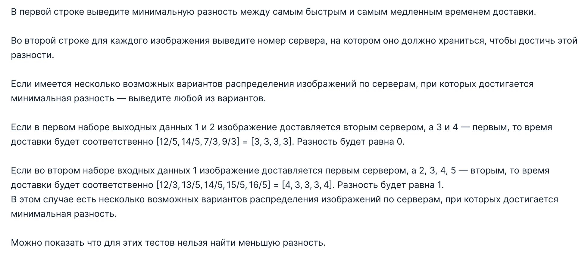

## Task 6: Content delivery

### Условие задачи

### Входные данные

### Выходные данные

### Пример теста 1
Входные данные
```
2
2
3 5
4
12 14 7 9
2
3 5
5
12 13 14 15 16
```
Выходные данные
```
0
2 2 1 1 
1
1 2 2 2 2 
```