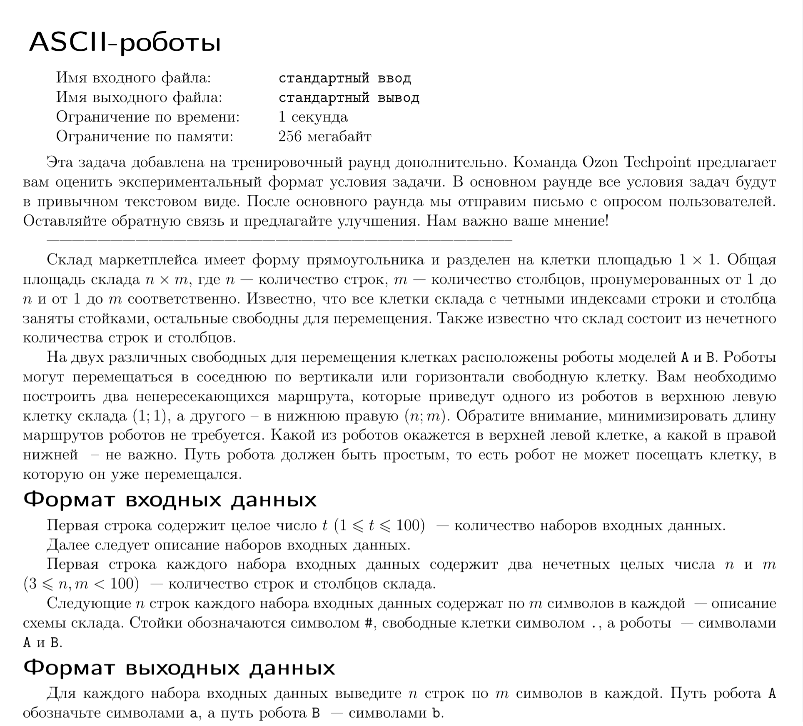

# ASCII-роботы



## Пример теста
---
- 1

Входные данные:
```
1
3 3
B..
.#.
..A
```
Выходные данные:
```
B..
.#.
..A
```
---
- 2

Входные данные:
```
2
5 5
.....
.#A#.
...B.
.#.#.
.....
7 9
.........
.#.#.#.#.
..AB.....
.#.#.#.#.
.........
.#.#.#.#.
.........
```
Выходные данные:
```
aaa..
.#A#.
...Bb
.#.#b
....b
aaa......
.#a#.#.#.
..ABb....
.#.#b#.#.
....b....
.#.#b#.#.
....bbbbb
```